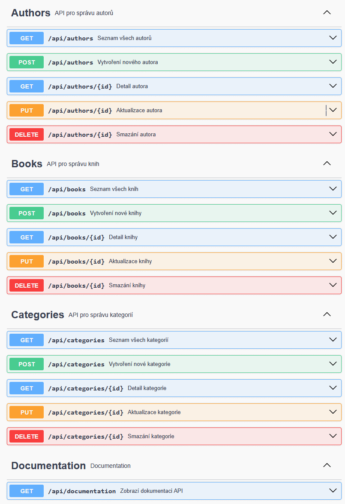
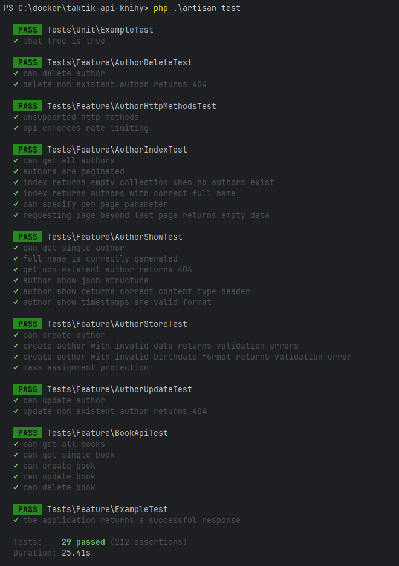

# Testovací úkol pro programátora - Laravel API

## Úvod
- Tento projekt je testovacím úkolem, který má demonstrovat schopnost vytvářet komplexní API pomocí frameworku Laravel.
- Úkolem je implementovat modely, vztahy mezi nimi, CRUD operace, cachování, ochranu před přetížením, dokumentaci pomocí Swagger a základní testy.
- Tento dokument popisuje jednotlivé části zadání a poskytuje návod k instalaci, spuštění i testování aplikace.
- Při úkolu byly intenzivně použity bezplatné umělé inteligence **Cloude 3.7 Sonet** a **GPT-4 o3**.

## Obsah dokumentace
- [Cíl úkolu](#cíl-úkolu)
- [Požadavky na API](#požadavky-na-api)
    - [1. Vytvoření API](#1-vytvoření-api)
    - [2. CRUD operace](#2-crud-operace)
    - [3. Výstup dat ve formátu JSON](#3-výstup-dat-ve-formátu-json)
    - [4. Implementace cachování](#4-implementace-cachování)
    - [5. Ochrana před přetížením (rate limiting)](#5-ochrana-před-přetížením-rate-limiting)
    - [6. Dokumentace API ve Swagger](#6-dokumentace-api-ve-swagger)
    - [7. Základní testy](#7-základní-testy)
- [Instalace a spuštění](#instalace-a-spuštění)
- [Použité technologie](#použité-technologie)
- [Další poznámky](#další-poznámky)

## Vlastní zadání úkolu úkolu
Cílem projektu je vytvořit jednoduché REST API, které:
- Pracuje s entitami: **Book**, **Author**, **Category**, **Rating** a **Comment**.
- Umožňuje definovat vztahy: one-to-many, many-to-many a polymorfní vztahy.
- Poskytuje kompletní podporu pro CRUD operace.
- Vrací data ve formátu JSON.
- Implementuje cachování pro zrychlení odezvy.
- Chrání API před přetížením pomocí rate limiting.
- Má kompletní a interaktivní dokumentaci pomocí Swagger.
- Obsahuje základní testy ověřující funkčnost endpointů.

## Požadavky na API

### 1. Vytvoření API
- **Popis:** Vytvoření nového projektu Laravel a definice entit a jejich vztahů.
- **Detaily:**
    - **Modely:** Vytvořit modely pro Book, Author, Category, Rating a Comment.
    - **Vztahy:**
        - *Book* může mít více *Authorů* (many-to-many).
        - *Author* může napsat více *Booků* (many-to-many).
        - *Book* může patřit do více *Category* (many-to-many).
        - *Rating* a *Comment* mají polymorfní vztahy, které umožňují, aby se vztahovaly jak ke knihám, tak k autorům.
- **Poznámka:** Důležité je správně nastavit databázové migrace a případné seed soubory pro testovací data, a factory s použitím faker třídy.


 ```text
1 Modely
php artisan make:model Book
php artisan make:model Author
php artisan make:model Category
php artisan make:model Rating
php artisan make:model Comment

2 Migrace
php artisan make:migration books
php artisan make:migration authors
php artisan make:migration categories
php artisan make:migration ratings
php artisan make:migration comments
php artisan make:migration book_category

3 API Controlery
php artisan make:controller Api/BookController --api
php artisan make:controller Api/AuthorController --api
php artisan make:controller Api/CategoryController --api

4 API Resources
php artisan make:resource BookResource
php artisan make:resource AuthorResource
php artisan make:resource CategoryResource
php artisan make:resource RatingResource
php artisan make:resource CommentResource

5 Validační požadavky
php artisan make:request BookRequest
php artisan make:request AuthorRequest
php artisan make:request CategoryRequest

5 Factory
php artisan make:factory BookFactory --model=Book
php artisan make:factory AuthorFactory --model=Author
php artisan make:factory CategoryFactory --model=Category
php artisan make:factory RatingFactory --model=Rating
php artisan make:factory CommentFactory --model=Comment
```


### 2. CRUD operace
- **Popis:** Implementace základních operací pro správu dat.
- **Detaily:**
    - API musí podporovat operace **GET**, **POST**, **PUT** a **DELETE** pro všechny modely.
    - Endpointy by měly umožnit filtrování, řazení, stránkování a případně i groupování výsledků.
- **Poznámka:** Každá operace musí být pečlivě navržena tak, aby byla odpověď konzistentní a ve formátu JSON.

```text
php .\artisan route:list
```


### 3. Výstup dat ve formátu JSON
- **Popis:** Veškeré odpovědi API musí být ve formátu JSON.
- **Detaily:**
    - Data z endpointů musí obsahovat všechny relevantní informace o modelech a jejich vztazích.
    - Validace vstupních dat a chybová hlášení rovněž musí být zpracovávána a vracena jako JSON.
- **Poznámka:** Tento přístup zajišťuje snadnou integraci API s front-end aplikacemi a dalšími službami.

### 4. Implementace cachování
- **Popis:** Zavedení cachovací vrstvy pro zvýšení výkonu API.
- **Detaily:**
    - Vybrat alespoň jeden endpoint, kde bude implementováno cachování (např. načítání seznamu knih).
    - Použít Laravel Cache.
    - Nastavit expiraci a správnou invalidaci cache, aby se zajistilo aktuální zobrazení dat.
- **Poznámka:** Cachování pomáhá zkrátit dobu odezvy a snížit zatížení databáze.

### 5. Ochrana před přetížením (rate limiting)
- **Popis:** Implementace ochrany API před zneužitím a DoS útoky.
- **Detaily:**
    - Nastavit omezení počtu požadavků na jednoho uživatele (např. maximálně 60 požadavků za minutu).
    - Využít vestavěnou funkcionalitu Laravelu pro rate limiting.
- **Poznámka:** Tato ochrana zajišťuje, že API zůstane dostupné i při vysoké zátěži a pomáhá předcházet útokům.


### 6. Dokumentace API ve Swagger
- **Popis:** Vytvoření a zpřístupnění dokumentace API pomocí Swagger (OpenAPI).
- **Detaily:**
    - Dokumentace musí popisovat všechny endpointy, metody, parametry a strukturu odpovědí.
    - Dokumentaci zpřístupnit přes specifický endpoint, například `GET /api/documentation`.
- **Poznámka:** Swagger dokumentace umožňuje ostatním vývojářům snadno pochopit, jak API funguje, a usnadňuje integraci.



### 7. Základní testy ověřující funkčnost
- **Popis:** Vytvoření automatizovaných testů pro ověření funkčnosti API.
- **Detaily:**
    - Použít Laravel testing framework.
    - Testy by měly ověřovat funkčnost jednotlivých endpointů, validaci vstupních dat a správnost odpovědí.
- **Poznámka:** Testy jsou klíčové pro udržení kvality kódu a usnadňují budoucí úpravy a refaktorizaci.



## Instalace a spuštění

### Požadavky
- **PHP 8.4**
- **Docker a Docker Compose**
- **Composer**
- **Laravel 12**
- **Databáze:** MySQL
- **Larastan** na levelu 8

### Instalace dockeru

```text
docker-compose up -d
```
Přístup k aplikaci:

- PHP aplikace by měla být dostupná na http://localhost.

### Instalace projektu
1. **Klonování repozitáře:**
   ```bash
   git clone https://github.com/radoshordos/taktik-api-knihy.git
   cd taktik-api-knihy
   php artisan migrate


